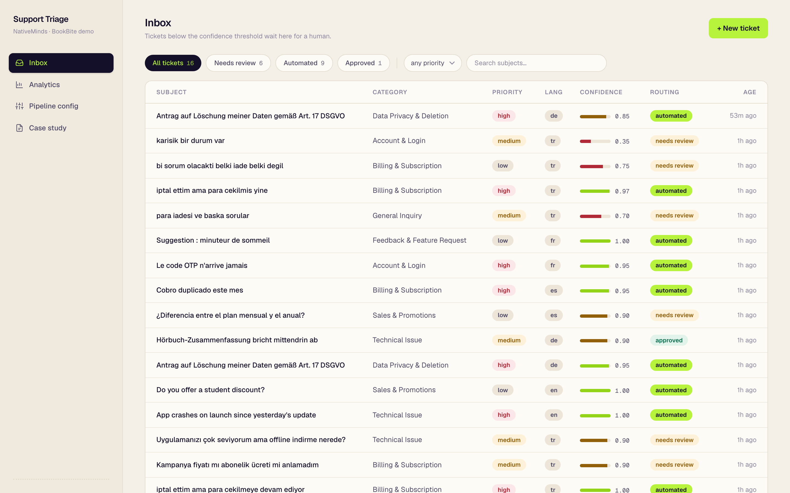
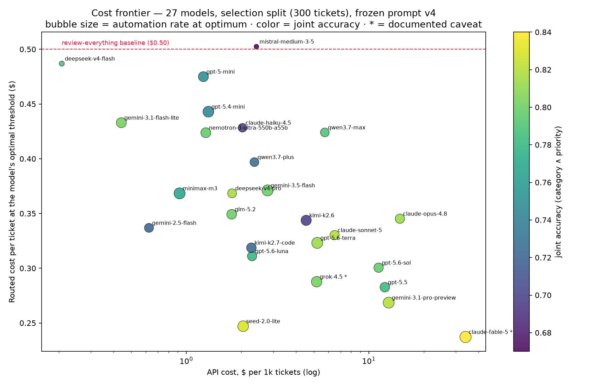
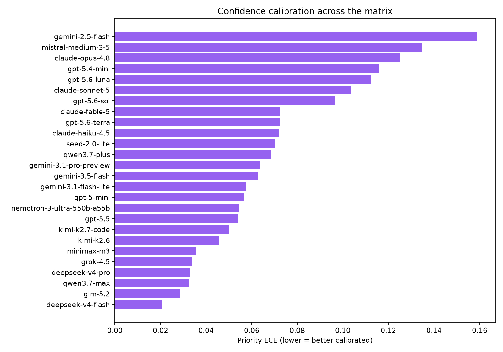
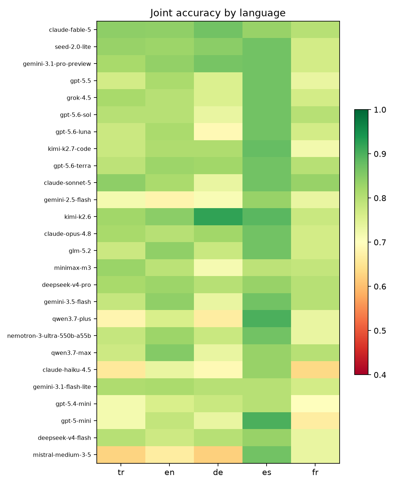
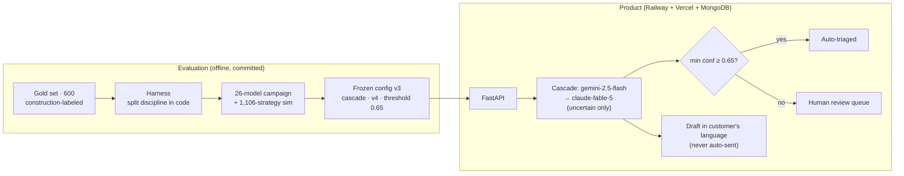

# Customer Support AI — NativeMinds Case Study (Section 5)

A deployed support-ticket system for a consumer subscription app: tickets arrive via API
in any language; an LLM cascade extracts **category, priority and a summary** with
per-field confidence and drafts a reply **in the customer's language**; a calibrated
confidence threshold decides, per ticket, whether the labels stand or a human reviews
them. Every model, prompt, threshold and even the *extraction strategy* in production is
the output of a committed evaluation — never an assumption.

> **Live demo:** [support-app-fatihbugrakdogans-projects.vercel.app](https://support-app-fatihbugrakdogans-projects.vercel.app)
> · **API:** [api-production-f83cb.up.railway.app/health/deep](https://api-production-f83cb.up.railway.app/health/deep)
> · **All seven case sections, answered:** [live /case page](https://support-app-fatihbugrakdogans-projects.vercel.app/case)
> · **Code:** [support-backend](https://github.com/fatihbugrakdogan/support-backend) ·
> [support-app](https://github.com/fatihbugrakdogan/support-app)

[](https://support-app-fatihbugrakdogans-projects.vercel.app)

## The 90-second reviewer path

1. Open the [live inbox](https://support-app-fatihbugrakdogans-projects.vercel.app) —
   tickets in five languages, each with labels, a confidence bar and a routing badge.
2. Click **+ New ticket** → pick the "🇹🇷 messy billing" sample → submit. Within ~10
   seconds the pipeline extracts labels, drafts a Turkish reply, and routes by confidence.
3. Open any **needs review** ticket: the AI's analysis with per-field confidence, the
   draft (never auto-sent), the correction panel, and the full event trail.
4. [Analytics](https://support-app-fatihbugrakdogans-projects.vercel.app/analytics) shows
   live automation rate and spend; [Pipeline config](https://support-app-fatihbugrakdogans-projects.vercel.app/settings)
   shows the frozen decision this product consumes.

## Final numbers (gold holdout, 150 never-touched tickets, run exactly once)

| Metric | Result |
|---|---|
| Category accuracy / macro-F1 | **88.7% / 0.881** |
| Priority accuracy / cost-weighted error | **86.7% / 0.083** |
| Language accuracy | **100%** |
| Automation @ its frozen threshold | **92.7%** at **79.9%** joint accuracy |
| High-priority tickets missed among automated | **2 of 150** (selection had 0 — reported as-is) |
| Extraction cost | **$2.25 per 1k tickets** |

The deployed pipeline is a **cascade**: `gemini-2.5-flash` answers everything it is
fully certain of (~1 s, ~55% of traffic); the rest escalates to `claude-fable-5`, the
intelligence-index leader — the overall winner of the strategy simulation
($0.237/ticket, 82.7% automation at **90.7%** joint accuracy on selection, routing
threshold at its measured optimum 0.65). The holdout table above was measured under the
prior seed-2.0-lite cascade and stays attributed to it (the holdout runs exactly once);
the models a deployment serves are mirrored in env vars, with the committed yaml as the
decision record. The objective behind every choice:

```
cost/ticket = API + P(review)·review_cost + Σ(graded error costs among automated)
```



## How the decision was made (all evidence committed)

**1. We refused to trust unaudited data.** The obvious public benchmark failed an
inter-model agreement test (two model families agree with each other 78%, with the
dataset's labels 29% — accuracy against them measures noise); a 200k-row Kaggle set
contained 10 unique texts. Both audits are committed. We built a 600-ticket
**construction-labeled** gold set instead (labels fixed *before* generation, non-candidate
generator, 40% Turkish, difficulty-engineered), with dev/selection/holdout splits enforced
by the harness itself.

**2. We caught the same flaw in our own data.** The first dev run showed priority stuck
at 54% with systematic errors. Root cause: the spec builder's `(i//8 + i) % 3` reduces to
`category % 3` — priority was a pure function of category. Same failure class we rejected
the benchmark for, rebuilt by our own generator, caught by our own audit. Fixed by
scenario-anchored priorities; the flawed run stays committed as evidence
([data notes](https://github.com/fatihbugrakdogan/support-backend/blob/main/docs/data-notes.md)).

**3. A 26-model campaign, then a 1,106-strategy simulation.** Selection was run on every
major family's flagship plus a deliberate price spread ($0.09–$10/MTok). The leaderboard
on the routed-cost objective:

| # | Model | Joint acc | Cost/ticket at optimum | Automation | API $/1k |
|---|---|---|---|---|---|
| 1 | claude-fable-5 † | 84.0% | $0.237 | 82.7% | $33.89 |
| 2 | seed-2.0-lite | 83.0% | $0.247 | 72.7% | $2.05 |
| 3 | gemini-3.1-pro-preview | 82.0% | $0.269 | 78.0% | $12.86 |
| 4 | gpt-5.5 | 78.3% | $0.283 | 54.7% | $12.24 |
| 5 | grok-4.5 † | 80.3% | $0.288 | 69.3% | $5.18 |
| 6 | gpt-5.6-sol | 79.7% | $0.300 | 51.3% | $11.32 |
| … | 20 more | | | | [summary.csv](https://github.com/fatihbugrakdogan/support-backend/blob/main/eval/campaign/summary.csv) |

† documented caveat: fable-5 shares a family with the labeling-policy author; grok-4.5
with the ticket generator. Both stay in the matrix with the flag.

Two findings drive everything: **price does not buy routed value** (the $2/1k budget
model sits $0.01/ticket from the $34/1k intelligence-index leader) and **calibration
decides** (two accurate models rank near last because their confidence signal cannot
support automation). Cascades and councils were then simulated at zero API cost from the
committed per-ticket artifacts; the frozen choice is the budget cascade — equal routed
cost to the leaders at a fraction of the API price, with 2.7× fewer tickets sent to
human review than the single-model optimum
([decision memo v2](https://github.com/fatihbugrakdogan/support-backend/blob/main/docs/decision-memo-v2.md)).





**4. We measured the real-world transfer gap instead of hiding it.** 80 real complaints
about the company's actual app (Şikayetvar), blind-labeled and human-verified before any
model saw them, evaluated once per frozen config: category 98.8%, high-priority recall
38/38 — but priority accuracy drops to 60% (every error a conservative over-escalation)
and **model self-confidence saturates out-of-distribution**, so a synthetic-calibrated
threshold over-automates on real traffic. Conclusion carried into the memo: recalibrate
on labeled production data before trusting automation rates
([real-world report](https://github.com/fatihbugrakdogan/support-backend/blob/main/docs/realworld-report.md)).

## Architecture



- `analyses` and `drafts` are **append-only**; every pipeline step writes an event — the
  audit trail is structural, not policy.
- A failed extraction routes to a human with the error on record; no ticket is lost.
- Swappable seams proved by use: the repository protocol absorbed a mid-project
  Postgres→MongoDB switch with zero service-layer changes, and the strategy protocol let
  the cascade replace the single model the same way
  ([architecture notes](docs/architecture.md)).

## Repository map

| Repo / dir | Contents |
|---|---|
| [support-backend](https://github.com/fatihbugrakdogan/support-backend) | `src/pipeline` (stages, prompts, taxonomy, frozen config) · `src/backend` (layered FastAPI) · `src/eval` (harness) · `eval/runs` (every number's artifacts) · `data/gold` · `docs` (memos, data notes, real-world report) |
| [support-app](https://github.com/fatihbugrakdogan/support-app) | Next.js triage UI in the NativeMinds design language (Tailwind v4, Geist) |
| this repo | Case-study narrative, [architecture notes](docs/architecture.md), Excalidraw diagram sources ([plan](docs/diagrams/plan.excalidraw), [decision flow](docs/diagrams/decisions.excalidraw), [unified architecture](docs/diagrams/unified-architecture.excalidraw), [ticket flow](docs/diagrams/ticket-flow.excalidraw), [eval methodology](docs/diagrams/eval-methodology.excalidraw)), figures |

## Run it locally

```bash
git clone https://github.com/fatihbugrakdogan/support-backend && cd support-backend
cp .env.example .env            # add OPENROUTER_API_KEY; MongoDB defaults to localhost
uv sync && uv run uvicorn --factory backend.app:create_app --port 8100

git clone https://github.com/fatihbugrakdogan/support-app && cd support-app
npm install && npm run dev      # http://localhost:3000
```

Tests (33, no live calls, no DB): `uv run pytest` · types: `uv run mypy` (strict) ·
reproduce an eval: `uv run python -m eval.run --prompt-version v4 --model <slug> --split dev`.

## Honest limitations

- The gold set is synthetic; real-world numbers are lower (we measured how much — see
  finding 4 — rather than asserting transfer).
- The extraction prompt encodes the same triage policy as the labels. The 80-ticket
  human-verified real set is the independent check; a first-touch (non-complaint-site)
  sample would be the next one.
- Draft quality was judged by a blind LLM judge, not human raters (gpt-5.6-luna won: 4.46/5, 80% head-to-head wins over the prior model, 60 tickets x 5 candidates); one run per configuration
  (±5pt CI at n=300 on accuracy gaps — the frontier's *shape* is the stable signal).
- Holdout confirmed an optimization-bias gap (joint accuracy −6.8pt vs selection) and two
  missed high-priority tickets among automated — the numbers above are the holdout's, not
  the selection split's.
