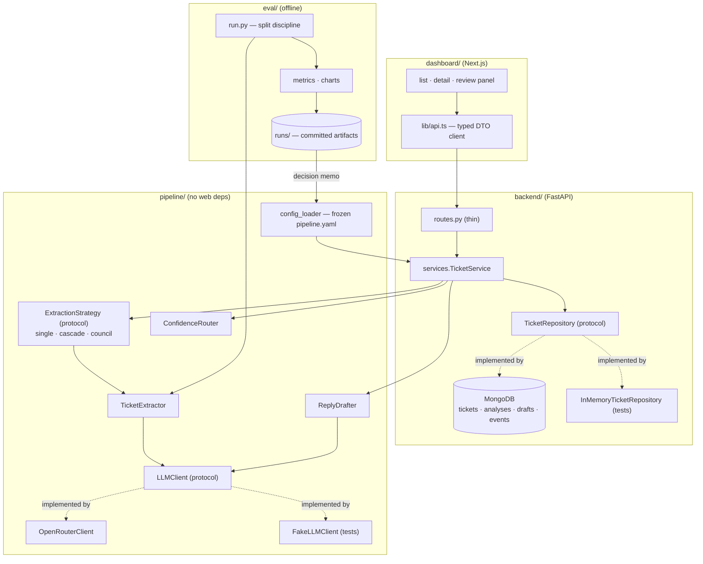
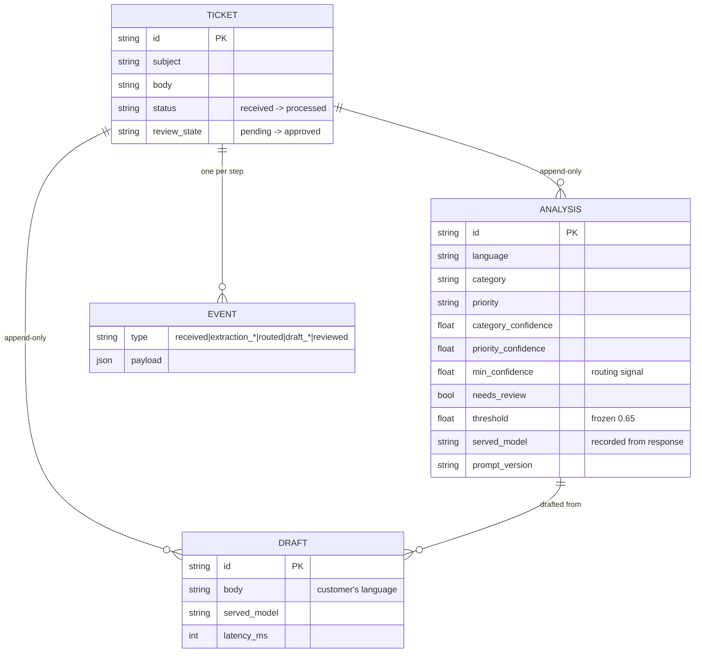
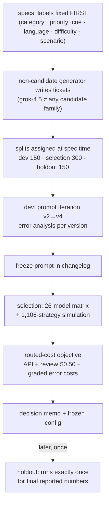

# Architecture

Companion to the [root README](../README.md); diagrams that don't fit the narrative there.
Excalidraw sources: [`diagrams/plan.excalidraw`](diagrams/plan.excalidraw) (the 8-day
gated plan), [`diagrams/decisions.excalidraw`](diagrams/decisions.excalidraw) (every major
option considered, rejected and chosen, with reasons).

## Component boundaries

Three protocols carry the whole design: swap `LLMClient` and the suite runs without a
network; swap `TicketRepository` and the database changes without touching business logic
(which is how Postgres → MongoDB happened mid-project in one commit); swap
`ExtractionStrategy` and a two-model cascade replaces a single model without the service
layer noticing (which is exactly how config v2/v3 shipped).

## Data model (documents)

The audit trail is **structural**: `analyses`, `drafts` and `events` have no update path
anywhere in the code — reprocessing appends. A reviewer's corrections live in the
`reviewed` event's payload, so the AI's original answer and the human's override are both
permanent.

## Eval methodology

Guardrails that exist as *code*, not policy: selection refuses non-frozen prompts;
holdout refuses to run twice or without the memo (both in eval/run.py and
scripts/run_holdout.py); ground-truth fields can't reach prompts
(they're never in the render path); an all-failures run aborts instead of emitting
plausible-but-empty metrics; the harness checks the OpenRouter balance before launching.
